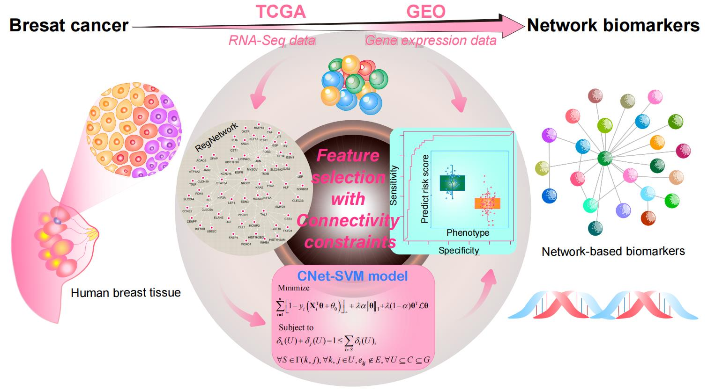

# [CNet-SVM (Connected network-constrained Support Vector Machine)](https://github.com/zpliulab/CNet-SVM)



In this work, a **connected network-constrained support vector machine (CNet-SVM) model** for feature selection considering the structural connectivity in a network was proposed. Mathematically, it was a convex optimization problem constrained by inequalities reflecting network connectivity.


## CNet
<!--START_SECTION:news-->
* **CNet**: A **connected network-constrained support vector machine (CNet-SVM) model** is proposed to perform **feature selection**. 
* In both **synthetic simulation data** and real-world **breast cancer (BRCA) genomics data**, we validated the CNet-SVM model is efficient to identify the **connected-network-structured features** that can serve as **diagnostic biomarkers**.
* In the comparison study, we also proved the proposed **CNet-SVM model** results in better classification performance and feature interpretability than one wrapped method named **SVM-RFE**, one filter method named **mRMR-SVM**, four embedded regularized support vector machine (Reg-SVM) alternatives: **Lasso-SVM**, **ENet-SVM**, **SCAD-SVM** and **L2DCAD-SVM** and two gtoup structural SVM methods: **GLasso-SVM** and **SGLasso-SVM**.
* If you have any questions about **CNet-SVM**, please directly contact the corresponding author [Prof. Zhi-Ping Liu](https://scholar.google.com/citations?user=zkBXb_kAAAAJ&hl=zh-CN&oi=ao) with the E-mail: zpliu@sdu.edu.cn
<!--END_SECTION:news-->


## Citation
Li, Lingyu, and Zhi-Ping Liu. "**Biomarker discovery from high-dimensional omics data by connected network-constrained support vector machine**." Submit to [Expert Systems with Applications](https://www.journals.elsevier.com/expert-systems-with-applications/).  


## Data
<!--START_SECTION:news-->
* In the **CNet-SVM**, **NSLR_example** and **matlab_example** files, we give all **R/Matlab/Python** codes. 
* In the **Data** file, we give some necessary input/output files by the **R/Matlab/Python** codes. 
* Some input files only give the first few lines, but this does not affect the results of the work (**CNet-SVM**).
* In the **Supplementary file** file, we present the necessary **Additional files** contained in our work. 
<!--END_SECTION:news-->


## R packages
* [glmSparseNet](https://bioconductor.org/packages/release/bioc/html/glmSparseNet.html) (v1.8.1). 
* [curatedTCGAData](https://www.bioconductor.org/packages/release/data/experiment/html/curatedTCGAData.html) (v1.12.1). 
* [TCGAutils](https://bioconductor.org/packages/release/bioc/html/TCGAutils.html) (v1.10.1). 
* [dplyr](https://cran.r-project.org/web/packages/dtplyr/index.html) (v1.0.8). To conduct regularized generalized Linear models (Elastic net penalty).
* [DESeq2](https://bioconductor.org/packages/release/bioc/html/DESeq2.html) (v1.30.1). 
* [pasilla](https://bioconductor.org/packages/release/data/experiment/html/pasilla.html) (v1.18.1). 
* [gglasso](https://cran.r-project.org/web/packages/gglasso/) (v1.5). 
* [SGL](https://cran.r-project.org/web/packages/SGL/) (v1.3). 


## R codes for Data (RforData)
The **serial number (1), (2), ..., (16)** represents the order in which the program runs in our work. 
<!--START_SECTION:news-->
* (1) ``TCGA_pro_clin_DE.R``  --  Get data of all samples, select 112 Tumor + 112 Normal samples to and get DEGs.
* (2) ``thetaSelectGEDFN.R``  --  Use GCWs method get top 1% genes, repeat 10 times, make union.
* (3) ``malacards_GEDFN_mamaprint_KEGG.R``  --  Integrate data from MalaCards, KEGG, Mamaprint, GCWs, DEGs to union gene and corresponding expression data.
* (4) ``network_match_union.R``  --  Get the network of union gene in RegNetwork, extract the expression data of TCGA corresponding to union gene, and scale them.
* (5) ``data_splitnew.R``  --  According to the random seeds of other methods, the scaled data of the union gene of TCGA is divided into training data and testing data.
* (6) ``adj_union.R`` ---- Adjacency matrix and its eigenvalues.
* (7) ``cut_union.R`` ---- Diameters and cut-nodes of component of DEGs in RegNetwork.
* (8) ``svmpenalized.R`` -- Output feature selection results of Lasso-SVM, Enet-SVM, SCAD-SVM and L2SCAD-SVM.
    ```ruby
    To test four embedded Reg-SVM methods, simply uses the function 'svmpenalized.R'.
    ```
* (9) ``penaltizedSVMtestNew.R`` -- Use 5-fold cross-validation (CV), embedding function ``svmpenalized.R``.
* (10) ``penaltizedSVMresultOnce.R`` -- Results for feature selection and classification on train data and test set.
* (11) ``filtermRMR.R`` -- Use ``svmpenalizedmRMR.R``, output feature, AUC and pred.
* (12) ``svmpenalizedmRMR.R`` -- A filter method, select a specified number of features, set feature num = 30.
* (13) ``svmRFE.R`` -- The SVM-RFE method for 20 experiments.
* (14) ``svmpenalizedsvmRFE.R`` -- Feature selection function for SVM-RFE.
* (15) ``svmRFE_once.R``  -- The SVM-RFE method for one experiment.
* (16) ``plotFeaturesmy.R`` -- Visualize stability functions of features.
* (17*) ``GL-HSVMonce.R`` -- Newly add GLasso-SVM method to compare with CNet-SVM.
* (18*) ``TCGA_pro_clin_DE_R3.R`` -- It accesses the whole data of breast cancer, 1205 samples.
* (19*) ``SGL-SVMonce`` -- Newly add SGL-SVM method to compare with CNet-SVM.
* (20*) ``TCGA_pro_clin_DE_R3.R`` -- It accesses the whole data of breast cancer, 1205 samples.
* (21*) ``heatmap_R3.R`` -- Followed "TCGA_pro_clin_DE_R3.R", it is used to see the 32 biomarkers's performance on whole 1205 sample of TCGA.
<!--END_SECTION:news-->


## R codes for Result (RforResult)
The **serial number (1), (2), ..., (4)** represents the order in which the program runs in our work. 
<!--START_SECTION:news-->
* (1) ``feature_select_all_new.R`` -- Extract the common genes of TCGA and GEO, using the identified 32 genes. 
* (2) ``class_net_svm.R`` -- Train on TCGA data, predict on GEO data, apply linear svm classifier for classification, observe results.
* (3) ``network_match_all_new.R`` -- Extract the net information of the biomarkers identified by each method.
* (4) ``ROCplot.R`` -- Plot ROC curves on independent datasets.
<!--END_SECTION:news-->


## R codes for simulating datasets (NLSR)
The **serial number (1), (2), ..., (9)** represents the order in which the program runs in our work. 
<!--START_SECTION:news-->
* (1) ``penaltizedSVMexample.R`` -- Try to generate simulation data, the output format used by R (.txt) is different from that used by matlab (.csv), and saved in the file SVM\R\NSLR
* (2) ``A_Simple_Example_svm.R`` -- Get the feature selection and classification results of SCAD, lasso, elastic net, L2SCAD ExampleData, the results are in the table result_example.csv* 
* (3) ``coef2feature_examplenew.R`` -- Extract the threshold according to the coefficient (obtained from matlab) to get the feature.
* (4) ``filtermRMRe_example.R`` -- Feature selection results of mRMR-SVM on simulated datasets.
* (5) ``svmRFE_example.R`` -- Feature selection results of SVM-RFE on simulated datasets.
* (6) ``svmpenalizedsvmRFE.R`` -- Serve svmRFE_example.R
* (7) ``svmrfeFeatureRanking.R`` -- Serves svmRFE_example.R
* (8) ``adj_example.R`` -- Adjacency matrix converted to a list of gene pairs
* (9) ``cut_example.R`` -- INPUT gene and gene net, OUTPUT cut node and cut_vector_UNgene
<!--END_SECTION:news-->


## Matlab codes for simulating datasets (SVMexamplenew)
<!--START_SECTION:news-->
* (1) ``SVMmainexample.m`` -- main function.
    ```ruby
    To test CNet-SVM method on simulation data, simply uses the script 'matlab -r SVMmainexample.m'.
    ```
* (2) ``costFunctionSVM.m`` -- Objective function.
* (3) ``cvSVM.m`` -- Cross validation to select optimal parameters.
* (4) ``Laplcian_Matrix.m`` -- Laplacian matrix according to the adjacency matrix.
* (5) ``LogitisLapSVM.m`` -- LogitisLap function for CV.
* (6) ``SGNLR.m`` -- SGNLR function for LogitisLap.
* (7) ``ErrorSVM.m`` -- Error function.
* (8) ``getLambMaxSVM.m`` -- getLambMax function for cv.
* (9) ``PredictSVM.m`` -- Predict function on test dataset.
* (10) ``plotROC.m`` -- Roc curve function on test dataset.
* (11) ``printConMat`` -- Output confusion matrix.
<!--END_SECTION:news-->


## Matlab codes for breast cancer dataset (SVMnew)
<!--START_SECTION:news-->
* (1) ``SVMmainUnion23.m`` -- main function.
    ```ruby
    To test CNet-SVM method on real BRCA data, simply uses the script 'matlab -r SVMmainUnion23.m'.
    ```
* (2) ``costFunctionSVM.m`` -- Objective function.
* (3) ``cvSVM.m`` -- Cross validation to select optimal parameters.
* (4) ``Laplcian_Matrix.m`` -- Laplacian matrix according to the adjacency matrix.
* (5) ``LogitisLapSVM.m`` -- LogitisLap function for cv.
* (6) ``SGNLR.m`` -- SGNLR function for LogitisLap.
* (7) ``ErrorSVM.m`` -- Error function.
* (8) ``getLambMaxSVM.m`` -- getLambMax function for cv.
* (9) ``PredictSVM.m`` -- Predict function on test dataset.
* (10) ``plotROC.m`` -- Roc curve function on test dataset.
* (11) ``confusion.m`` -- Confusion matrix. 
* (12) ``printConMat`` -- Output confusion matrix.
<!--END_SECTION:news-->


## Python codes (GEDFNsvm)
<!--START_SECTION:news-->
* (1) ``main_SVM.py`` -- GCWs methods for feature selection.
    ```ruby
    To conduct GCWs method, simply use script 'python main_SVM.py'.
    ```
* (2*) ``rfe_rf_R3.ipynb`` -- Newly add Random Forest (RF) method to compare with CNet-SVM.
    ```ruby
    To test RF method on whole 1205 BRCA data, simply run 'rfe_rf_R3.ipynb' use jupyter notebook.
    ```
<!--END_SECTION:news-->


## CNet (2023), Zhi-Ping Liu all rights reserved
This program package is supported by the copyright owners and coders "as is" and without warranty of any kind, express or implied, including, but not limited to, the implied warranties of merchantability and fitness for a particular purpose. In no event shall the copyright owner or contributor be liable for any direct, indirect, incidental, special, exemplary, or consequential damages (including, without limitation, procurement of substitute goods or services; loss of use, data, or profits; or business interruption), regardless of the theory of liability, whether in contract, strict liability or tort (including negligence or otherwise) for any use of the software, even if advised of the possibility of such damages.
